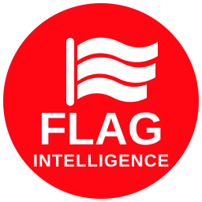

<p>
  
</p>
<br clear="both">

<h1 align="center">FLAG INTELLIGENCE</h1>

<p align="center">
  <b>Recognize a flag — or type a country name — and explore the country behind it.</b>
</p>

Flag Intelligence is a personal computer-vision and country-intelligence project that combines worldwide flag recognition with a source-aware learning system.

The project has evolved beyond image classification. A user can now either:

- upload a flag image and let the vision model identify the country; or
- type a country name or ISO code directly and open the same Country Intelligence experience without using the vision model.

Both paths converge on one shared country-knowledge pipeline.

---

## Product goal

The long-term goal is simple:

> **Upload a flag or name a country, then learn that country in depth without needing to visit it first.**

Flag Intelligence is designed to provide a structured, sourced overview of a country while avoiding sensitive or private information.

The system aims to answer questions such as:

- What country is this flag associated with?
- What does the flag mean?
- Where is the country located?
- What is its historical journey?
- How was the modern state formed?
- What languages and religions are present?
- What are its major cities, rivers, mountains and climate zones?
- What drives its economy?
- What are its important industries, exports and natural resources?
- How is the country governed?
- What are its major cultural traditions and heritage sites?
- What emergency and practical information is useful to know?

---

## Current input modes

### 1. Flag image

```text
Upload flag image
      ↓
Worldwide vision model
      ↓
Robust prediction + open-set decision
      ↓
Accepted country
      ↓
Country Intelligence
```

The image workflow provides:

- top prediction;
- confidence;
- Top-1 margin;
- ranked alternatives;
- visually equivalent flag handling;
- accepted / ambiguous decision state.

### 2. Country name

```text
Type country name or ISO code
      ↓
Deterministic country resolver
      ↓
Country Intelligence
```

Examples:

```text
France
Côte d’Ivoire
Ivory Coast
Japan
South Korea
FR
FRA
CI
XK
```

Text input does **not** simulate image recognition. No artificial confidence score is created. The interface explicitly reports that the country was selected by name.

---

## Country Intelligence

Once a country is resolved, the system builds a structured country record from multiple public sources.

Current knowledge domains include:

### Country identity

- country name;
- ISO alpha-2 / alpha-3;
- capital;
- region and subregion;
- population and reference year;
- area;
- official language(s);
- currency;
- demonym;
- time zones;
- calling code;
- internet domain;
- driving side.

### Flag Intelligence

When a reliable dedicated source is available:

- adoption date;
- proportions;
- design and construction;
- symbolism;
- historical flag context;
- similar or visually confusable flags.

### Geography

- geographic location;
- borders;
- major cities;
- coordinates;
- highest and lowest points;
- climate and seasons;
- rivers, lakes and waterways;
- mountains and relief;
- natural resources;
- environment and biodiversity.

### History

- origins and early history;
- historical timeline;
- major political transitions;
- colonial history where historically applicable;
- occupation / partition / union / dissolution handling;
- independence or sovereignty transition where applicable;
- key independence-era figures where relevant.

The history model does **not** force every country into a colonial-independence template. Countries without a classical independence transition are handled separately.

### Government and institutions

- government form;
- head of state;
- head of government;
- administrative divisions;
- major institutions;
- international organizations.

Current political office holders are treated as time-sensitive data and should be interpreted with their source freshness in mind.

### People and society

- demographic context;
- languages;
- religion;
- health-system context;
- social structure where reliable source material exists.

### Culture

- cuisine;
- music;
- sport;
- literature and arts;
- traditions;
- festivals and holidays;
- UNESCO and heritage sites;
- notable public figures when adequately sourced.

### Economy

- GDP and reference year;
- economic structure;
- agriculture;
- industry;
- services;
- key economic drivers;
- exports and imports;
- important production sectors;
- natural-resource links where available.

### Infrastructure

- transport overview;
- roads and rail;
- ports;
- airports;
- energy;
- electricity;
- connectivity and telecommunications.

### Education and science

- education context;
- universities / research context where available;
- science and innovation information.

### Practical information

- local emergency numbers;
- calling code;
- driving side;
- internet domain;
- basic country-level practical information.

Emergency numbers are presented as local numbers and are kept separate from the international calling code.

---

## Ask Flag Intelligence

The application also includes a retrieval-style question interface.

Users can ask questions such as:

```text
What is the capital?
What happened in 1960?
What does the flag mean?
Which countries border Côte d’Ivoire?
What are the main economic sectors?
```

Answers are produced from the structured Country Intelligence record. Missing information is not intentionally fabricated.

---

## Reports and exports

Accepted / selected countries can generate:

- JSON output;
- an A4 Country Intelligence PDF;
- sourced country-learning sections;
- country maps and core profile information.

The PDF is content-driven: sections are included when the knowledge pipeline has usable source-backed information.

Image mode can include the uploaded flag preview. Text mode can generate the same report without requiring an uploaded image.

---

## Source strategy

Flag Intelligence is intentionally source-aware.

The current pipeline combines structured and encyclopedic sources such as:

- Wikidata;
- World Bank;
- REST Countries;
- Wikipedia / MediaWiki;
- dedicated country-topic pages where available.

The system separates:

1. structured facts;
2. topic-specific enrichment;
3. historical timeline extraction;
4. flag-specific enrichment;
5. report validation.

The design rule is:

> **Prefer missing information over confidently publishing unsupported information.**

Different facts may have different reference years. Time-sensitive information must therefore retain source and freshness context.

---

## Worldwide coverage

The project taxonomy currently contains **250 classes**:

- 249 ISO 3166-1 country / territory codes;
- Kosovo as the additional project class `XK`.

The vision model and the Country Intelligence system are designed around this worldwide taxonomy.

This does **not** mean that every deep-learning section is equally complete for every country. Public-source structure and availability vary substantially by country.

---

## Worldwide Country Intelligence audit

A dedicated automated audit now evaluates the complete 250-class taxonomy.

```text
250 country / territory classes
          ↓
5 audit shards
          ↓
Country profile + Country Intelligence
          ↓
Structural and content-quality checks
          ↓
Merged worldwide JSON / CSV report
```

The audit checks, among other things:

- all expected country codes are covered;
- required report sections are present;
- optional deep sections are measured separately;
- raw MediaWiki templates are not leaked into reports;
- bibliography / references do not become fake timeline events;
- sovereignty metadata is coherent;
- report manifests are structurally valid;
- critical pipeline exceptions are surfaced.

GitHub Actions publishes:

- per-shard JSON;
- per-shard CSV;
- merged worldwide JSON;
- merged worldwide CSV;
- section coverage statistics;
- countries requiring correction.

The audit uses retries, exponential backoff and reduced concurrency to limit false failures caused by public-source rate limits.

The worldwide audit is a validation system, not a claim that all 250 reports are already equally complete.

---

## Recognition model

The current worldwide visual reference remains a lightweight **MobileNetV3-Small** classifier.

Why MobileNetV3-Small:

- fast experimentation;
- modest model size;
- CPU-friendly inference;
- suitable for Streamlit deployment;
- appropriate baseline for large-class flag recognition.

The deployment checkpoint is:

```text
artifacts/models/worldwide_mobilenet_v3_small.pt
```

---

## Recognition evaluation

The project evaluates more than raw Top-1 accuracy.

### Classification

- Top-1 accuracy;
- Top-5 accuracy;
- macro precision;
- macro recall;
- macro F1;
- per-country recall;
- confusion matrix.

### Calibration and open-set behavior

- Negative Log-Likelihood;
- Expected Calibration Error;
- AUROC;
- AUPR;
- FPR@95TPR;
- confidence / entropy analysis;
- accepted vs rejected predictions.

### Efficiency

- parameter count;
- model size;
- inference latency;
- throughput.

---

## Real-world robustness

The current reference comparison on the human-reviewed real-world challenge set remains:

| System | Top-1 | Top-5 |
|---|---:|---:|
| V1 worldwide classifier | 19.61% | 27.45% |
| Scene-aware V2 | 17.65% | 30.39% |
| Detector + V1 | 19.61% | 30.39% |

Flag-detector localization rate:

```text
73.53%
```

The scene-aware model and detector-first pipeline were not promoted because they did not improve Top-1 accuracy over the V1 reference.

This evaluation suggests that the dominant recognition limitation is real-world visual generalization, not only flag localization.

The Wikimedia challenge set remains evaluation-only.

---

## Similar-flag handling

Special attention is given to visually similar or identical national / territorial flags.

Examples include:

- Côte d’Ivoire / Ireland;
- Chad / Romania;
- Indonesia / Monaco;
- Netherlands / Luxembourg;
- Australia / New Zealand.

The application also merges known labels that share the same visible official flag where necessary to avoid misleading probability fragmentation.

---

## Architecture

```text
                         ┌────────────────────┐
                         │   Flag image input │
                         └─────────┬──────────┘
                                   │
                            Vision inference
                                   │
                         Open-set decision
                                   │
                                   ▼
┌────────────────────┐     ┌────────────────────┐
│ Country-name input │────▶│ Canonical country  │
│ or ISO code        │     │ identity / code    │
└────────────────────┘     └─────────┬──────────┘
                                     │
                                     ▼
                         ┌───────────────────────┐
                         │ Country profile layer │
                         └───────────┬───────────┘
                                     │
                                     ▼
                         ┌───────────────────────┐
                         │ Country Intelligence  │
                         │ enrichment pipeline   │
                         └───────────┬───────────┘
                                     │
                  ┌──────────────────┼──────────────────┐
                  ▼                  ▼                  ▼
            Interactive UI       JSON export       PDF report
```

---

## Main Country Intelligence modules

```text
src/flag_recognition/
├── country_info.py
├── country_intelligence.py
├── country_knowledge.py
├── flag_knowledge.py
├── learning.py
├── report_manifest.py
├── taxonomy.py
├── inference.py
├── model.py
├── detection.py
├── dataset.py
├── metrics.py
├── splits.py
└── transforms.py
```

Responsibilities:

- `country_info.py` — structured country facts and source integration;
- `country_intelligence.py` — canonical knowledge model;
- `country_knowledge.py` — educational and topic-specific enrichment;
- `flag_knowledge.py` — dedicated flag metadata and history;
- `learning.py` — Ask Flag Intelligence retrieval;
- `report_manifest.py` — official report section validation;
- `taxonomy.py` — worldwide country-code and text-name resolution;
- `inference.py` — visual prediction pipeline.

---

## Repository structure

```text
country-flag-recognition/
├── app.py
├── serve.py
├── assets/
├── configs/
├── data/
├── artifacts/
│   ├── models/
│   ├── metrics/
│   └── figures/
├── scripts/
│   ├── audit_country_intelligence_world.py
│   ├── audit_taxonomy.py
│   ├── prepare_splits.py
│   ├── train.py
│   ├── train_deployment.py
│   ├── evaluate.py
│   ├── evaluate_deployment.py
│   ├── evaluate_real_world_challenge.py
│   └── ...
├── src/
│   └── flag_recognition/
├── tests/
├── .github/
│   └── workflows/
│       ├── tests.yml
│       ├── country-intelligence-audit.yml
│       └── worldwide-country-intelligence-audit.yml
├── pyproject.toml
├── requirements.txt
└── README.md
```

---

## Run the Streamlit application

```bash
pip install -r requirements.txt
streamlit run app.py
```

The Streamlit application is currently the most complete interface for:

- flag-image recognition;
- direct country-name input;
- Country Intelligence;
- Ask Flag Intelligence;
- JSON export;
- PDF reports;
- maps;
- source-aware learning sections.

---

## Product web interface

A separate FastAPI / responsive web interface also exists:

```bash
pip install -r requirements.txt
PYTHONPATH=src uvicorn serve:app --reload
```

Then open:

```text
http://127.0.0.1:8000
```

The standalone web interface and Streamlit interface may not expose every experimental feature at exactly the same time.

---

## Tests

Run the unit test suite with:

```bash
pytest
```

Tests cover areas including:

- taxonomy;
- country-name resolution;
- country profile extraction;
- sovereignty logic;
- country knowledge extraction;
- historical timelines;
- flag metadata;
- report manifests;
- dataset splits;
- metrics.

---

## Worldwide audit

Run a local shard:

```bash
PYTHONPATH=src python scripts/audit_country_intelligence_world.py \
  --shard-index 0 \
  --shard-count 5 \
  --timeout 12 \
  --output-dir artifacts/world_audit
```

GitHub Actions runs the full sharded worldwide audit and merges the results automatically.

---

## Current status

Flag Intelligence currently has four major working layers:

1. **Worldwide visual flag recognition**
2. **Direct country-name / ISO lookup**
3. **Source-aware Country Intelligence**
4. **Automated worldwide quality auditing**

The project is under active validation.

The vision model still has substantial room for improvement on uncontrolled real-world imagery, and deep country-information coverage is not yet uniform across all 250 classes.

The goal is not to hide those gaps. The audit system is specifically designed to expose them so they can be corrected systematically.

---

## Design principles

- no fabricated country facts;
- no fake recognition confidence for text-selected countries;
- source-aware information;
- historical models adapted to the country rather than forcing one template;
- time-sensitive data treated as time-sensitive;
- missing information preferred over incorrect information;
- image and text inputs converge on the same Country Intelligence pipeline;
- validation should happen across the full worldwide taxonomy, not only a few example countries.

